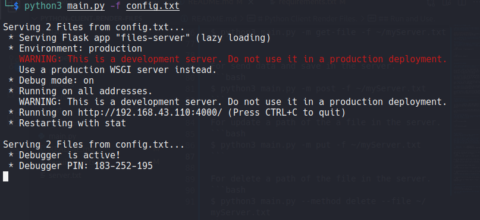

# Python Client Render Files.

__This is a small client for make requests GET, POST, PUT and DELETE, to the routes of our server (Server Files).__

__This is the server for files.__
[https://github.com/EduardYan/python-server-render-files](https://github.com/EduardYan/python-server-render-files)

__Is a complement for save the content of the json object, that the routes of the server return. In our device.__

------------------------------------------------------------------------

## Dependencies.
__This proyect only depend of requests module. You can install this dependency with the requirements file in this proyect. Executing:__

```bash
$ pip3 install -r requirements.txt
```

__Or:__

```bash
$ pip3 install requests
```

-------------------------------------------------------

## Methods and Routes.

__Our server files have this routes for use (alls the routes return a json object):__

* __/__ or __/home__ (This route have the method GET). With this route we can to have access to alls the paths of files allows in the server, through of a json objcet.

* __/get-file__ (This route have the method GET). With this route we can to get a file in the server, according to your id. The id we can to get with the route /.

* __/add-path__ (This route have the method POST). Here we can to send data for add a new path of the file, in the server.

* __/update-path__ (This route have the method PUT). Here we can to update a path of file in the server, according to your id.

* __/delete-path__ (This route have the method DELETE). With this route we will can delete a path of file in the server, according to your id.

------------------------------------------

## Options for use.
__We must pass diferents options in the execution of our client.__

* __-m__ or __--method__ With this options we can pass the method for make the request of the server files: GET, GET-FILE, POST, PUT or DELETE.

* __-f__ or __--file__ With this option we can pass the file that have the direction of our server.

### File with the server.
__We must pass the path of the file with the direction server, with the option -f. The file should be written as well:__

```txt
http://localhost:4000
```

```txt
http://127.0.0.1:8000
```

---------------------------------------------------

## Run and Use.
__Equal that to Server Files, we must pass diferents options of the command:__

__In alls the options (get, get-file, post, put, delete), we can pass in uppercase or lowercase. And we will can save the output of our requests in a file, give the path (not permited relatives paths, only obsuletes paths).__

* __Relative__ ---> ~/myOutput.txt
* __Absoulete__ ---> /home/your_user/myOutput.txt

-------------------------------------------
Here we are running our client with the method get for the route *"/" or "/home"*. And with the file with the direction of server in the file of this proyect. I put a file called server.txt, there you can put the direction of the server.

```bash
$ python3 main.py -m get -f ./server.txt
```

Using the route for get a file in the server.
```bash
$ python3 main.py -m get-file -f ./server.txt
```

For send data and save in the server.
```bash
$ python3 main.py -m post -f ./server.txt
```

For update a path of the a file in the server.
```bash
$ python3 main.py -m put -f ./server.txt
```

For delete a path of the file in the server.
```bash
$ python3 main.py --method delete --file ./server.txt
```

## Examples of use.
1. __Starting our server:__


2.  __Gettings alls the information with the route and method get.__


3. __We can save the ouput in a file.__


4. __File where we saved the get request.__


5. __Using get-file, the more util.__

*We got the content of the file in the server and extra information. We will get the same with the other routes.*

6. __When you save a request get-file, you are saving the key *content* of the json object.__


7. __Using post, for send data to our server files.__

*We got the new files in the server, after of the send the new path of file.*

8. __Using put, for update a path of file.__

*We go the new list of paths with the file number 0 updated.*

9. __Using delete, for delete a path of file.__

*Removing the file number 4.*

## Images not supported.
__If we put a file of image (jpg, png) or other. You will get a error.__


__It does not mea that the file is not on the server if not what can not read it for this in binary.__

__But you can see the image in the browser.__


---------------------------------------------------------
## Errors or Bugs.
Send me a email to eduarygp@gmail.com